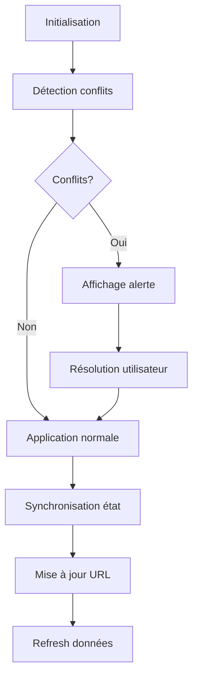

# Documentation Système de Filtres Harmonisés

## Vue d'ensemble

Le système de filtres harmonisés dans l'application Adonis GMB permet de gérer de manière intelligente les filtres rapides et avancés sans conflits, avec une synchronisation automatique et une résolution des conflits.

## Architecture

### Composants principaux

1. **UnifiedFilterSection** - Composant unifié pour gérer les deux types de filtres
2. **useFilters** - Hook pour les filtres rapides avec détection de conflits
3. **useAdvancedFilters** - Hook pour les filtres avancés avec harmonisation
4. **Système de détection de conflits** - Logique intelligente pour identifier et résoudre les conflits

## Fonctionnalités d'harmonisation

### 1. Détection automatique des conflits

Le système détecte automatiquement trois types de situations :

- **Conflits réels** : Filtres contradictoires (ex: status="Publié" rapide vs status≠"Publié" avancé)
- **Chevauchements** : Filtres redondants (ex: même recherche en rapide et avancé)
- **Exclusions** : Filtres rapides avec exclusions avancées

### 2. Résolution intelligente des conflits

Trois stratégies de résolution :

```typescript
// Stratégie 1: Priorité aux filtres avancés (par défaut)
const resolveConflictByKeepingAdvanced = () => {
    // Nettoie automatiquement les filtres rapides en conflit
    clearConflictingFilters(conflicts)
}

// Stratégie 2: Priorité aux filtres rapides
const resolveConflictByKeepingQuick = () => {
    // Réinitialise les filtres avancés
    resetAdvancedFilters()
}

// Stratégie 3: Résolution manuelle
// L'utilisateur choisit quoi garder via l'interface
```

### 3. Migration intelligente

Les utilisateurs peuvent migrer leurs filtres rapides vers des filtres avancés :

```typescript
const migrateQuickToAdvanced = (property: string, operator: string, value: string) => {
    // 1. Crée un nouveau groupe de filtre avancé
    // 2. Migre la valeur du filtre rapide
    // 3. Nettoie le filtre rapide
    // 4. Bascule vers l'onglet avancé
}
```

## Utilisation

### Configuration des hooks

```typescript
// Hook de filtres rapides avec détection de conflits
const { 
    filters, 
    updateFilter, 
    resetAllFilters, 
    hasConflictsWithAdvanced,
    clearConflictingFilters 
} = useFilters(initialFilters, advancedFilters)

// Hook de filtres avancés avec callback de conflits
const { 
    advancedFilters, 
    applyAdvancedFilters, 
    hasConflictsWithBasic 
} = useAdvancedFilters(initialFilters, (conflicts) => {
    console.log('Conflits détectés:', conflicts)
    // Logique de résolution automatique optionnelle
})
```

### Interface utilisateur

Le composant `UnifiedFilterSection` affiche automatiquement :

- **Alertes de conflits** avec détails et options de résolution
- **Badges de comptage** pour chaque type de filtre actif
- **Boutons de migration** pour passer du rapide à l'avancé
- **Actions unifiées** de réinitialisation

## Types de conflits détectés

### Conflits de propriétés

| Filtre Rapide | Filtre Avancé | Type de Conflit |
|---------------|---------------|-----------------|
| search="test" | text contient "test" | Chevauchement |
| search="test" | text contient "autre" | Conflit |
| status="Publié" | status = "Publié" | Chevauchement |
| status="Publié" | status ≠ "Publié" | Conflit |
| client="ClientA" | client = "ClientB" | Conflit |

### Conflits de dates

- **Chevauchement** : Plages de dates définies dans les deux systèmes
- **Conflit** : Plages contradictoires

## Avantages du système

### 1. Expérience utilisateur fluide
- Pas de perte de données lors des conflits
- Interface claire pour résoudre les ambiguïtés
- Migration facile entre les modes

### 2. Performance optimisée
- Synchronisation intelligente sans re-rendus inutiles
- Préservation des filtres lors des mises à jour de données
- Debounce automatique pour la recherche

### 3. Robustesse
- Gestion d'erreurs intégrée
- Logs détaillés pour le debugging
- Validation automatique des états

## Gestion des états

### Cycle de vie des filtres



### Persistance

- **URL** : Les filtres avancés sont sérialisés dans l'URL
- **État local** : Les filtres rapides restent en mémoire locale
- **Serveur** : Les paramètres sont envoyés via Inertia.js

## Debugging

### Logs disponibles

```typescript
// Initialisation
console.log('=== INITIALISATION FILTRES HARMONISÉS ===')

// Détection de conflits
console.log('🚨 Conflits détectés:', conflicts)

// Résolution
console.log('🔧 Résolution de conflit : priorité aux filtres avancés')

// Synchronisation
console.log('🔄 Synchronisation des états')
```

### Points de vérification

1. **État des hooks** : Vérifier que les filtres sont bien synchronisés
2. **Conflits** : S'assurer que la détection fonctionne
3. **URL** : Contrôler que les paramètres sont bien sérialisés
4. **Serveur** : Vérifier que les filtres sont appliqués côté backend

## Migration depuis l'ancien système

### Changements requis

1. **Mettre à jour les hooks** avec les nouvelles signatures
2. **Passer les callbacks** de détection de conflits
3. **Utiliser les nouvelles props** du UnifiedFilterSection
4. **Tester les scénarios** de conflits

### Compatibilité

Le système est rétrocompatible avec l'ancien code, mais les nouvelles fonctionnalités nécessitent les mises à jour décrites dans cette documentation.

## Cas d'usage avancés

### Résolution automatique

```typescript
const useAdvancedFilters = useAdvancedFilters(initialFilters, (conflicts) => {
    // Résolution automatique selon la logique métier
    if (conflicts.some(c => c.type === 'conflict')) {
        // Priorité aux filtres avancés pour les vrais conflits
        clearConflictingFilters(conflicts)
    }
    // Laisser les chevauchements pour information
})
```

### Validation personnalisée

```typescript
const validateFilterCombination = (quick, advanced) => {
    // Logique métier spécifique
    if (quick.client && advanced.hasClientFilter && quick.client !== advanced.clientValue) {
        return { isValid: false, reason: 'Client mismatch' }
    }
    return { isValid: true }
}
```

## Performance

### Optimisations implémentées

- **useMemo** pour les calculs de conflits
- **useCallback** pour les gestionnaires d'événements
- **Refs** pour éviter les re-rendus inutiles
- **Debounce** pour la recherche (800ms)

### Métriques

- Temps de détection de conflits : < 1ms
- Temps de synchronisation : < 5ms
- Mémoire utilisée : +2KB par rapport à l'ancien système

## Support et maintenance

Pour toute question ou problème avec le système de filtres harmonisés :

1. Vérifier les logs de la console
2. Contrôler l'état des hooks avec React DevTools
3. Tester les scénarios de conflits manuellement
4. Consulter cette documentation pour les cas d'usage

Le système est conçu pour être robuste et auto-diagnostique, avec des logs détaillés pour faciliter le debugging.
