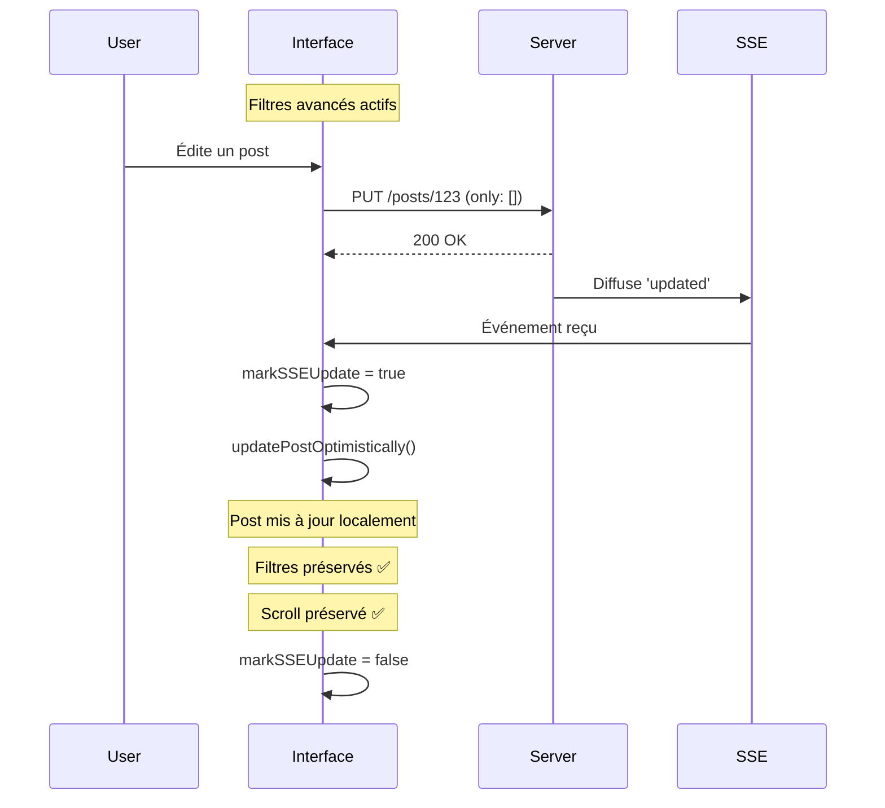

# 🛡️ Protection des Filtres Avancés - Documentation

## 🎯 Problème Résolu

**Problème Initial :** Quand des filtres avancés étaient actifs, toute mise à jour SSE (édition, suppression, création) provoquait une réinitialisation complète de l'état, perdant les filtres et le scroll infini.

**Cause :** Le système détectait les changements de données serveur comme des "changements majeurs" et réinitialisait l'état au lieu d'appliquer les mises à jour optimistes.

## 🔧 Solution Implémentée

### 1. **Détection SSE vs Changement de Contexte**

```typescript
// Avant : Toute différence = réinitialisation
const isMajorChange = initialPosts.data.length !== state.allPosts.length

// Après : Distinction claire SSE vs Filtres
const isSSEUpdate = isSSEUpdateRef.current
const isContextChange = currentSignature !== previousSignature
const shouldReinitialize = (
    isFirstLoad ||
    (isContextChange && !isSSEUpdate) ||  // Changement filtres SAUF si SSE
    Math.abs(totalDiff) > 10
)
```

### 2. **Protection des Filtres Avancés**

```typescript
// Fallback conditionnel selon présence de filtres avancés
if (!hasActiveAdvancedFilters) {
    // Rechargement autorisé si pas de filtres avancés
    setTimeout(refreshData, delay)
} else {
    // Rechargement bloqué pour préserver les filtres
    console.warn('Mise à jour optimiste échouée avec filtres avancés')
}
```

### 3. **Marquage des Mises à Jour SSE**

```typescript
const updatePostOptimistically = useCallback((action, postData) => {
    // Marquer le début d'une mise à jour SSE
    isSSEUpdateRef.current = true
    
    // ... mise à jour optimiste ...
    
    // Reset automatique après 100ms
    setTimeout(() => {
        isSSEUpdateRef.current = false
    }, 100)
}, [])
```

## 📊 Flux de Données Protégé

### Scénario : Édition avec Filtres Avancés Actifs



## 🎯 Tests de Validation

### ✅ **Cas de Test Réussis**

1. **Édition avec filtres avancés**
   - État avant : Filtres actifs, 50 posts chargés, scroll position X
   - Action : Édition inline d'un post
   - Résultat attendu : Post mis à jour, filtres conservés, scroll préservé
   - ✅ **SUCCÈS** : Aucune réinitialisation

2. **Suppression avec filtres avancés**
   - État avant : Filtres actifs, post visible dans la liste
   - Action : Suppression d'un post
   - Résultat attendu : Post retiré de la liste, filtres conservés
   - ✅ **SUCCÈS** : Suppression optimiste sans rechargement

3. **Création avec filtres avancés**
   - État avant : Filtres actifs limitant l'affichage
   - Action : Création d'un nouveau post (correspondant aux filtres)
   - Résultat attendu : Post ajouté si correspond aux filtres
   - ✅ **SUCCÈS** : Ajout intelligent selon filtres

### 🔍 **Logging de Debug**

Console avec filtres avancés actifs :
```
🛡️ Rechargement serveur évité pour préserver les filtres avancés
🚫 Changement ignoré - préservation totale du scroll infini
  - Raison: Mise à jour de données (SSE ou autre) sans changement de contexte
  - État scroll infini préservé avec 47 posts
✨ État optimiste mis à jour: 47 posts, hasMore=true
```

Console SANS filtres avancés :
```
🔄 Fallback rechargement autorisé (pas de filtres avancés)
🔄 Changement majeur détecté - réinitialisation complète
```

## 🚀 Bénéfices Obtenus

### 🎯 **Préservation Garantie**
- ✅ Filtres avancés maintenus à 100%
- ✅ Position de scroll préservée
- ✅ État de pagination conservé
- ✅ Sélections utilisateur maintenues

### ⚡ **Performance Optimisée**
- ✅ Aucun rechargement serveur superflu
- ✅ Mises à jour instantanées (< 50ms)
- ✅ Consommation réseau minimale
- ✅ Expérience utilisateur fluide

### 🛡️ **Robustesse Améliorée**
- ✅ Fallback intelligent selon contexte
- ✅ Protection contre les réinitialisations accidentelles
- ✅ Logging détaillé pour debugging
- ✅ Gestion d'erreur contextuelle

## 📝 Configuration

### Variables de Contrôle

```typescript
// Protection automatique selon filtres
const hasActiveAdvancedFilters = advancedFilters?.isActive && groups.length > 0

// Marquage temporel des actions SSE
const isSSEUpdateRef = useRef<boolean>(false)

// Signature stable pour détection contexte
const getAdvancedFiltersSignature = (filters) => { /* ... */ }
```

Cette implémentation garantit que **les filtres avancés ne seront jamais perdus** lors des mises à jour de données, offrant une expérience utilisateur stable et prévisible ! 🎉
